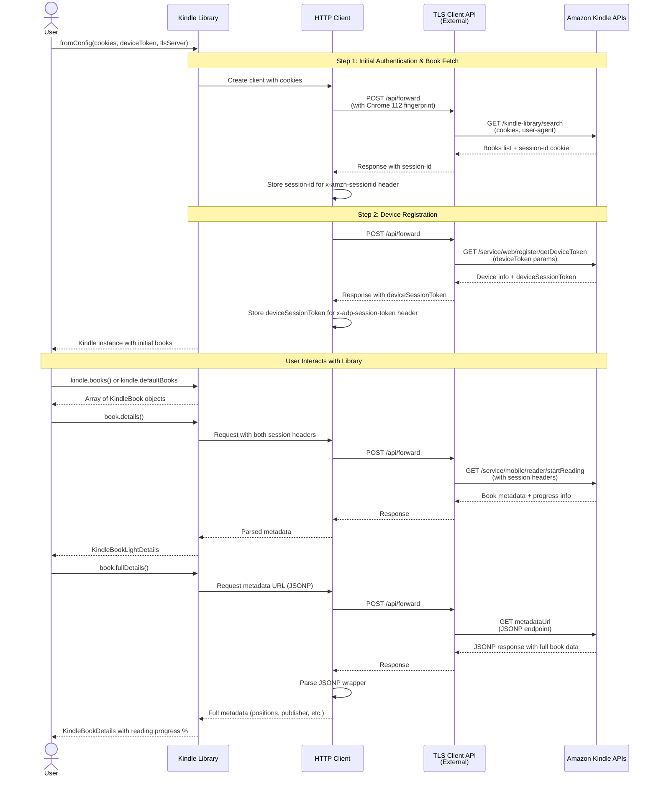

# Kindle-Api

A zero dependency, blazing fast library for Amazon Kindle's private API built without headless browsers.

## How It Works

This library interacts with Amazon Kindle's private APIs through a sophisticated multi-step authentication and session management flow. Below is a high-level overview of the architecture and data flow:



### Key Components

1. **TLS Fingerprint Evasion**: Amazon implemented TLS fingerprinting in July 2023 to detect automated clients. This library uses an external [tls-client-api](https://github.com/bogdanfinn/tls-client-api) that mimics Chrome 112's TLS fingerprint, making requests indistinguishable from a real browser.

2. **Cookie-Based Authentication**: Instead of automating the login flow (which requires SMS 2FA), the library uses four long-lived cookies that remain valid for a year:
   - `ubid-main` - User browser ID
   - `at-main` - Authentication token
   - `x-main` - Additional authentication token
   - `session-id` - Session identifier

3. **Dual Session Management**: The library maintains two types of session tokens:
   - **Session ID** (`x-amzn-sessionid` header): Obtained from the books endpoint, required for all subsequent API calls
   - **ADP Session Token** (`x-adp-session-token` header): Obtained from device registration, required for accessing book metadata

4. **HTTP Client Proxy Pattern**: All requests go through the TLS proxy which:
   - Receives request parameters (URL, headers, method)
   - Applies Chrome 112 TLS fingerprint
   - Forwards to Amazon with proper browser-like characteristics
   - Returns response data to the library

5. **Pagination Support**: The books endpoint returns a `paginationToken` that can be used to fetch additional pages of books.

6. **Lazy Loading**: Book details are fetched on-demand with two different levels of detail (see detailed comparison below)

This architecture allows the library to operate without headless browsers, making it significantly faster and more lightweight while remaining undetectable to Amazon's bot protection systems.

### `book.details()` vs `book.fullDetails()`

The library provides two methods for fetching book information, optimized for different use cases:

#### `book.details()` - Lightweight Progress Check
- **API Calls**: 1 request to `/service/mobile/reader/startReading`
- **Response Format**: JSON
- **Use Case**: Quick checks for whether a book has been read since last sync
- **Returns**:
  - Basic book info (title, ASIN, authors, cover URLs)
  - Reading progress position (raw number)
  - Last sync timestamp and device name
  - Metadata URL for further requests

**Example**: Checking if any of your books have been read today
```typescript
const details = await book.details();
if (details.progress.syncDate > lastCheckTime) {
  console.log(`${book.title} was read on ${details.progress.reportedOnDevice}`);
}
```

#### `book.fullDetails()` - Complete Book Information
- **API Calls**: 2 requests (or 1 if you pass in cached details)
  1. First request: Same as `details()` (can be skipped if you pass cached details)
  2. Second request: JSONP endpoint at the `metadataUrl` 
- **Response Format**: JSONP (wrapped JSON that needs parsing)
- **Use Case**: Getting complete book information including calculated reading progress percentage
- **Returns**: Everything from `details()` plus:
  - **Reading percentage** (calculated from position / endPosition)
  - Publisher information
  - Release date
  - Start position (where actual content begins)
  - End position (total book length)

**Example**: Tracking detailed reading progress
```typescript
const fullDetails = await book.fullDetails();
console.log(`${book.title}: ${fullDetails.percentageRead}% complete`);
console.log(`Published by ${fullDetails.publisher} on ${fullDetails.releaseDate}`);
```

**Performance Tip**: If you already called `details()`, pass it to `fullDetails()` to avoid the duplicate request:
```typescript
const details = await book.details();
// ... do something with details ...
const fullDetails = await book.fullDetails(details); // Reuses the first call
```

#### Quick Comparison Table

| Feature | `details()` | `fullDetails()` |
|---------|-------------|-----------------|
| API Requests | 1 | 2 (or 1 if cached) |
| Reading Progress | ✅ Raw position | ✅ Percentage (0-100%) |
| Sync Timestamp | ✅ | ✅ |
| Device Name | ✅ | ✅ |
| Publisher | ❌ | ✅ |
| Release Date | ❌ | ✅ |
| Book Length (positions) | ❌ | ✅ |
| Response Time | ~100-200ms | ~200-400ms |
| Best For | Checking if book was read | Getting complete progress info |

## Installation

```
pnpm add kindle-api
```

## Setup

Ok I kinda lied about the zero dependency part. The library does actually depend on an external [tls-client-api](https://github.com/bogdanfinn/tls-client-api) to proxy requests due to amazon's recent changes to their TLS fingerprinting in July 2023. You'll need to run the server locally to be able to use this library. It's quite easy to set up and have one running in a few minutes and will save you tons of headache if you wanna do other kinds of scraping in the future

### Cookies

Amazon's login system is quite strict and the SMS 2FA makes automating logins difficult. Instead of trying to automate that with puppeteer and slow things down, we use 4 cookies that stay valid for an entire year.

- `ubid-main`
- `at-main`
- `x-main`
- `session-id`

You can grab these values directly by going on inspect element after loading [read.amazon.com](https://read.amazon.com) and copying the entire thing or just the select ones 

### Device Token

We also need a deviceToken for your kindle. You can grab this from the same network window as before on the `getDeviceToken` request that looks like:

https://read.amazon.com/service/web/register/getDeviceToken?serialNumber=(your-device-token)&deviceType=(your-device-token)


Both of those numbers should be the same.

### Usage

Upon creating the `Kindle` object, you'll load the first batch of books.

```js
import { Kindle } from "kindle-api";

const kindle = await Kindle.fromConfig({
  cookies: "ubid-main=xxx.xxxx ...",
  deviceToken: "(your-device-token)",
  tlsServer: {
    url: "https://your-tls-server-api.com",
    apiKey: "(your-api-key)",
  },
});

console.log(kindle.defaultBooks);

/*
[
  KindleBook {
    title: 'Project Hail Mary: A Novel',
    authors: [ { firstName: 'Andy', lastName: 'Weir' } ]
    imageUrl: 'https://m.media-amazon.com/images/I/51YS2zsN+iL._SY400_.jpg',
    asin: 'B08FHBV4ZX',
    originType: 'PURCHASE',
    productUrl: 'https://m.media-amazon.com/images/I/51YS2zsN+iL._SY400_.jpg',
    mangaOrComicAsin: false,
    webReaderUrl: 'https://read.amazon.com/?asin=B08FHBV4ZX'
  },
  KindleBook {
    title: 'Engineering Management for the Rest of Us',
    authors: [ { firstName: 'Sarah', lastName: 'Drasner' } ],
    imageUrl: 'https://m.media-amazon.com/images/I/61xVsTw0gIL._SY400_.jpg',
    asin: 'B0BGYVDX35',
    originType: 'PURCHASE',
    productUrl: 'https://m.media-amazon.com/images/I/61xVsTw0gIL._SY400_.jpg',
    mangaOrComicAsin: false,
    webReaderUrl: 'https://read.amazon.com/?asin=B0BGYVDX35'
  }
]
*/
```

## Book Details

Here's an example of how you could implement a script that keeps track of your book progress

```ts
import { setTimeout } from "node:timers/promises";

// assuming we saved our previous run
const previous = await getPreviousData();

// you can use `await kindle.books()` if you want to re-fetch your book list
for (const book of kindle.defaultBooks) {
  const details = await book.details();

  const readSinceLastTime =
    details.progress.syncDate > previous.get(details.asin).lastSync;

  if (readSinceLastTime) {
    // make another request to fetch full book details
    // including reading progress
    const fullDetails = await book.fullDetails(details);
    console.log(fullDetails.percentageRead); // 45
  }

  // add a delay after each book lookup to not spam and get banned
  await setTimeout(5000);
}
```

## Missing features

- [ ] Pagination
- [ ] Reading book content? Can't think of a usecase for this one
- [ ] Basically anything that isn't just getting book info
